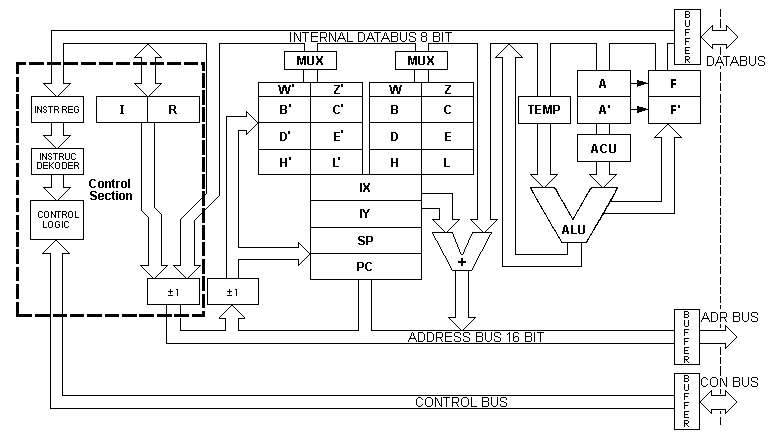
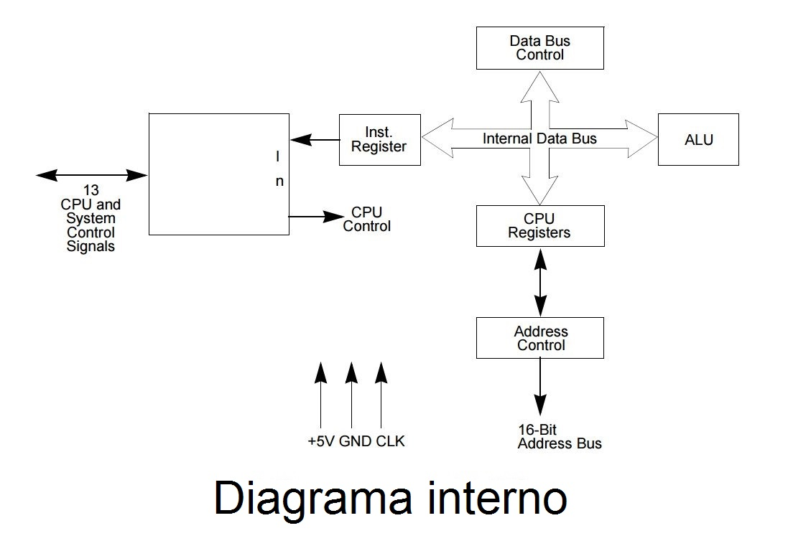

# Trabajo-de-investigación
Tema: Explicar el funcionamiento de Collapse OS. La arquitectura del microprocesador z80 y simular ejemplos para z80.

1) PLANTEAMIENTO DEL PROBLEMA.

El sistema operativo Collapse OS es un peculiar proyecto de sistema operativo de código abierto concebido para usarlo en los momentos que la humanidad lo necesite, en un mundo postapocalíptico donde la era de la electrónica y tecnología que hoy conocemos ya no exista. El microprocesador Z80 de 8 bits será el encargado de ejecutar este sistema operativo, ya que son muy antiguos, se podrían encontrar masivamente en cualquier parte del mundo y otra característica importante es que tan solo cuenta con 9.000 transistores, por lo que sería mucho más sencillo de reprogramar que un procesador moderno con miles de millones de transistores. En la historia de la tecnología los microcontroladores poseen una gran importancia, ya que son usados para todo tipo de aplicaciones, computadoras, cajas registradoras, instrumentos musicales, calculadoras gráficas y centenares de productos electrónicos hasta aplicaciones mucho más avanzadas, y complejas, por lo tanto, aprender a utilizar correctamente estos dispositivos es importante para las personas en carreras técnicas. Una de las mayores dificultades a la hora de aprender a implementar estos dispositivos, no es como se podría pensar la construcción del circuito, sino aprender a programarlos.

Los microcontroladores se han constituido en un elemento primordial para el avance de las nuevas tecnologías, de ahí parte la necesidad de no solo conocerlos en sus usos también como emplearlos, la programación se convierte en algo apremiante de conocer, las herramientas con las cuales se pueda adquirir conocimiento son muy importantes.

2) OBJETIVOS

Objetivo General

Conocer el sistema operativo Collapse OS junto con la estructura del microprocesador Z80 y encontrar la relación entre ellos posteriormente realizar un ejemplo del microprocesador Z80

Objetivos Especificos

    •	Investigar el funcionamiento del sistema operativo Collapse O.S y como es que Funcionará con microprocesadores Z80 de 8 bits.
    •	Investigar la arquitectura del microprocesador Zilog Z80 para realizar algoritmos que nos permitan hacer simulaciones y comprender mejor su funcionamiento.
    •	Comprender y explicar el funcionamiento de Collapse Os.
    •	Conocer la arquitectura del microprocesador Z80.
    •	Simular ejemplos del z80.

3) ESTADO DEL ARTE

1. Collaspe OS

El investigador, desarrollador Virgil Dupras es creador de 'Collapse OS', un sistema operativo de código abierto que, afirma, está diseñado para funcionar en aquellos componentes electrónicos fáciles de reciclar. Es decir, es una plataforma que serviría para aprovechar la basura electrónica cuando ya no existan nuevos dispositivos electrónicos. Está pensado para ser usado en los momentos de un mundo postapocalíptico donde la tecnología ya no existe.

En el año 2019 se lanza el sistema operativo de código abierto diseñado para poder ejecutarlo desde cualquier dispositivo sin necesidad de ningún recurso externo. Se trata de un software, llamado Collapse OS, que tiene como objetivo suavizar las consecuencias tecnológicas de un posible colapso mundial que posiblemente llegue en el 2030.

Collapse aún no ha sido terminado en su totalidad ya que su invertor (Virgil Dupras) ha decidido publicar su proyecto en la plataforma GitHub para que más desarrolladores que estén interesados en aportar con el desarrollo y las pruebas correspondientes.  Originalmente está pensado para que pueda funcionar en microprocesadores Z80, su creador ha programado tanto el núcleo del sistema operativo como algunos programas y herramientas. 

Un sistema operativo que, afirma, está diseñado para funcionar en aquellos componentes electrónicos fáciles de reciclar. Es decir, una plataforma que serviría para aprovechar la basura electrónica cuando ya no existan nuevos dispositivos electrónicos.
Así lo explicó Dupras a Vice: "Hago esto para mitigar un riesgo que creo que es real. No es inevitable, pero probablemente lo suficiente para justificar un esfuerzo modesto"(Virgil Dupras).

2. Microprocesador Z80

El Intel 8080, lanzado en 1974, fue el primer microprocesador de 8 bits que tuvo éxito entre la comunidad de programadores, teniendo como principal exponente al MITS Altair 8800. Dos años después y con la intención de hacerse con el mercado, Zilog lanzó el Z80, que atrajo a los programadores de la época al ser totalmente compatible con la arquitectura del Intel 8080 y añadir nuevas e interesantes funcionalidades, como un set de instrucciones extendido.
El Z80 tuvo tanto éxito que es posible encontrarlo en gran cantidad de máquinas de principios de los ochenta, como el Osborne 1, el ZX Spectrum o el Commodore 128. Podría decirse, por tanto, que el Zilog Z80 es una versión mejorada del Intel 8080.

Hoy en día, el Z80 se sigue utilizando, en una de sus últimas evoluciones (el Zilog eZ80) como microprocesador de algunas calculadoras gráficas y como microprocesador de algunos sistemas embebidos, lo cual da una idea de su versatilidad si tenemos en cuenta que se lanzó al mercado en 1976. 

El Z80 tenía ocho mejoras fundamentales 

    •	Un conjunto de instrucciones mejorado, incluyendo los nuevos registros índice IX e IY y las instrucciones necesarias para manejarlos.
    •	Dos bancos de registros que podían ser cambiados de forma rápida para acelerar la respuesta a interrupciones.
    •	Instrucciones de movimiento de bloques, E/S de bloques y búsqueda de bytes.
    •	Instrucciones de manipulación de bits.
    •	Un contador de direcciones para el refresco de la DRAM integrado, que en el 8080 tenía que ser proporcionado por el conjunto de circuitos de soporte.
    •	Alimentación única de 5 voltios.
    •	Necesidad de menos circuitos auxiliares, tanto para la generación de la señal de reloj como para el enlace con la memoria y la E/S.
    •	Más barato que el Intel 8080.
    •	Un tipo especial de reset que sólo reinicia el contador de programa de modo que el Z80 se puede usar en un sistema de desarrollo ICE

A fines de 1975, incluso antes de anunciar el Z80, Faggin tuvo claro que la compañía necesitaba un sucesor de 16 bits para el Z80. Sintió que los procesadores de 16 bits eran el futuro y que el futuro era inminente. En ese momento, Zilog tenía todos los 11 empleados. Sin embargo, Faggin no quería crear una versión ampliada de 16 bits del Z80, un "super Z80". Además, no se sentía calificado para desarrollar una nueva arquitectura de microprocesador de 16 bits a partir de todo el tejido, por lo que buscó un arquitecto de procesadores experto. Encontró al Dr. Peuto, que había estado trabajando en la arquitectura mainframe 470 / V6 compatible con IBM de Amdahl desde 1973. Peuto se convirtió rápidamente en el duodécimo empleado de Zilog. (Leibson, 2019).

4) MARCO TEORICO

Microprocesadores.

Intel Corporation.

Intel fue fundada el 18 de julio de 1968 como Integrated Electronics Corporation son los pioneros en semiconductores Robert Noyce y Gordon Moore, y muchas veces asociados con la dirección ejecutiva y la visión de Andrew Grove.
Pero Intel no siempre tuvo la visión de futuro acertada. Moore recuerda como a mediados de los 70 le propusieron comercializar el 8080 equipado con un teclado 37 y un monitor orientado al mercado doméstico. Es decir, le estaban proponiendo ser los pioneros en el mundo de las computadoras personales. Pero no vieron la utilidad de esos aparatos, y descartaron la idea.
(JOHN HANNER MARQUEZ ORTIZ, 2013)

En el año 1969, un equipo de ingenieros japoneses de la compañía BUSICOM llegó a Estados Unidos con una idea, ellos deseaban usar para sus proyectos pocos circuitos integrados de los que se usaban en las calculadoras. La proposición se hizo a INTEL (JOHN HANNER MARQUEZ ORTIZ, 2013).

El Intel 4004 fue el primer microprocesador de la historia y, tras éste, Intel desarrolló otro procesador más del cual se encargó Federico Faggin, responsable del Intel 4004, al que se le encargó el desarrollo de un procesador de 8 bits, el Intel 8080 que también gozó de un gran éxito en el mercado.

Al finalizar este proyecto en 1974, Faggin pensó que era hora de volar en solitario y afrontar nuevos proyectos y decidió fundar su propia compañía, Zilog, en la que se desarrollaría otro mítico procesador: el Zilog Z80.

 Microprocesador Zilog Z80

Faggin decidió afrontar el desarrollo de un nuevo procesador que, desde el punto de vista práctico, fuese totalmente compatible con el Intel 8080 pero que, en prestaciones, fuese mejor.

Tras dos años de trabajo, en los que Faggin diseñó la arquitectura del procesador y supervisó la fabricación, el Zilog Z80 fue lanzado al mercado en julio de 1976.De ahí que el Intel 8080 tenga su parecido con el Z80, pero añadiendo nuevos registros y un juego de instrucciones ampliado para trabajar en ello, los registros del microprocesador permiten almacenar valores en memoria y realizar diferentes operaciones con ellos. 

Este microprocesador cuenta con registros de 8 bits, que pueden juntarse en grupos de dos para realizar operaciones de 16 bits, muy lejos de los 64 bits que utilizan los microprocesadores actuales.
Un año después sale al mercado el primer computador que hace uso del Z80, el Tandy TRS-80 Model 1 con un Z80 a 1,77 MHz y 4 KB de RAM. Acaba desplazando al 8080 del mercado por su menor precio y mayores prestaciones.

Fue muy popular durante los años 80 debido principalmente a dos razones: ser compatible con el Intel 8080 ya que fue el mismo Faggin quien lo diseño, y ser popularizado por varias videoconsolas (Amstrad CPC, Sinclair ZX Spectrum). Posteriormente ha sido utilizado por tras videoconsolas (Sega Master System, Nitendo Game Boy Advance y chip dedicado de audio en la Sega MegaDrive). 
Tras del Z80 Zilog introduce varios procesadores de 16 bits y 32 bits, pero sin mucho éxito, por lo que la compañía se orienta al mercado de microcontroladores, produciendo CPUs básicas y Circuitos Integrados para Aplicaciones Específicas (ASICs/ASSPs) construidos alrededor del núcleo de sus procesadores.

CARACTERÍSTICAS: 

•	El set de instrucciones contiene 158 instrucciones. Están incluidas las 78 instrucciones del 8080 y se mantiene la compatibilidad de software con el 8080. 

•	Reloj de 8, 6, 4 y 2.5 MHz. Para el Z80H, Z80B, Z80A y Z80 CPU, resultando una rápida ejecución de instrucciones con la consecuente transferencia elevada de datos. 

•	El extenso set de instrucciones incluye operaciones con palabras, bit, byte y cadena de caracteres. Búsqueda y transferencias de bloques a la vez mediante indexado y direccionamiento relativo, resultando el más competente y poderoso procesador de datos en la industria de los microcomputadores. 

•	El microprocesador Z80 y la familia asociada de periféricos controladores pueden ser enlazados por un sistema vectorizado de interrupciones. Este sistema podría ser DaisyChained que permita la implementación de un esquema de interrupciones prioritario, se requiere poca lógica adicional para el acoplamiento. 

•	Set duplicado de registros de banderas y de propósito general. 

•	Dos registros índices de 16 bits. 

•	Contador de refresco de memoria dinámica.

El Z80 resulta ser un microprocesador más rápido y sencillo en el desarrollo de sistemas ya que solo usa una fuente de alimentación de +5 Volts, contiene íntegramente todo el conjunto de instrucciones del 8080, lo cual le permite ejecutar todos los programas escritos para el CPU 8080, contiene el Z80 una expansión adicional de 80 instrucciones de ahí se deriva su nombre, su repertorio suma un totaL DE 158 Instrucciones. 

LA UNIDAD ARITMÉTICA Y LÓGICA (ALU)

Las operaciones del CPU Z80 se realizan con un grupo de dispositivos lógicos conocidos comúnmente como unidad aritmética y lógica (ALU) esta efectúa las siguientes operaciones:
1. Suma binaria.
2. Operaciones lógicas.
3. Complementar a dos.
4. Corrimiento de un bit a la derecha o a la izquierda.
5. Registro de resultados importantes como el acarreo, signo, acarreo auxiliar, paridad o si el resultado es cero.
6. Comparaciones
7. Poner, Limpiar o probar un bit

REGISTROS DE PROPÓSITO GENERAL

Los registros constituyen una especie de pequeña memoria interna al microprocesador. El Z-80 tiene registros de 8 y 16 bits, si bien los de 8 bits se pueden agrupar de 2 en 2 para formar uno de 16 bits. Todas las operaciones que realiza el Z-80 se hacen entre números
contenidos en los registros, o bien, entre un registro y una posición de memoria; por eso se dice que el Z-80 es un microprocesador orientado hacia los registros. La posibilidad de agrupar dos registros de 8 bits para formar uno de 16, permite al Z-80 realizar operaciones de 16 bits a pesar de ser un microprocesador de 8 bits. El Z-80 tiene, en total, 18 registros de 8 bits y 4 registros de 16 bits. Algunos son de uso general y otros tienen asignadas funciones específicas.

El microprocesador Z80 separados en dos grupos:
GRUPO 1: los registros principales son

     A, B, C, D, E, H, y L
     
GRUPO 2: los registros alternos

     A', B', C', D', E', H' y L
     
Estos registros son de 8 bits, pero pueden agruparse por pares (sin contar “A Y A'”) en registros de 16 bits de la forma BC, DE, HL y B'C', D'E', H'L'. Tienen la particularidad de que solo son accesibles a la vez 6 de ellos, pues están divididos en 2 bancos intercambiables por medio de unas instrucciones.
Con los 14 registros de propósito general se efectúan, por medio de las instrucciones las siguientes funciones:
1.	Recibir datos desde la memoria.

2.	Enviar datos hacia la memoria.

3.	Incrementar o decrementar en su contenido.

4.	Formar una dirección con el contenido de un par de registros.

5.	Transferir datos entre los registros.

6.	Obtener un operando durante las funciones de la ALU. 

7.	Autorreplica: puede ensamblarse desde sí mismo, con suficiente RAM y almacenamiento.

8.	Tiene soporte de almacenamiento masivo.

9.	Conocido para ejecutarse en:

a.	Un RC2014 a través de un enlace en serie. También puede tener un teclado PS / 2 conectado directamente.

b.	Un Sega Master System o un MegaDrive (Genesis) con salida de video y entrada D-Pad y / o un adaptador de teclado PS / 2.

c.	Una TI-84 + con salida en la pantalla LCD y entrada en el teclado incorporado.

d.	Un TRS-80 Modelo 4P con video incorporado y teclado.

A, F y A', F'. Como en el caso anterior se trata de registros de 8 bits de los que solo dos son accesibles al mismo tiempo por estar divididos en bancos. El registro A es el acumulador que, como podemos ver en el gráfico, siempre será unos de los operandos de la ALU (Unidad Aritmético Lógica). Por su parte, en el registro F se encuentran los flags de la máquina que guardan su estado.

Banderas de estado (Flags)

 El microprocesador tiene 8 Flips Flops, para monitorear ciertos resultados de las operaciones de la ALU, a la información que almacenan estos Flips Flops se conoce como banderas de estado, las banderas se actualizan después de cada operación con alguno de los registros, no todas las operaciones modifican a todas las banderas, de los 8 bits del registro de banderas, únicamente seis registran información útil para el programador, cuatro de estas banderas se prueban, esto es, se usan como condiciones de salto (JP), llamada (CALL), o regreso (RET), estas banderas son:
 
Bit 7: Flag S. Es el flag que indica el signo, es decir, una copia del bit más significativo de la última operación de la ALU.

Bit 6: Flag Z. Este flag indica si el resultado de la última operación es cero.

Bit 5: Flag 5. Guarda una copia del bit 5 del resultado de la última operación.

Bit 4: Flag H. Guarda el acarreo del bit 3 al 4 de la operación.

Bit 3: Flag 3.Guarda una copia del bit 3 del resultado de la última operación.

Bit 2: Flag P/V. Dependiendo de la operación, en este bit se muestra si el resultado tiene paridad par o bien hubo desbordamiento.

Bit 1: Flag N. Se activará si la última operación fue una resta.

Bit 0: Flag C. Es el bit de acarreo, se activará si el resultado de la operación no entra en el registro. 

La paridad o sobre flujo(P/V) 
La bandera “P” se utiliza para realizar funciones auxiliares necesarias para el usuario, le sirven para interpretar los resultados, es uno cuando el resultado de la operación lógica del complemento a dos produce un acarreo, de otro a formar es un cero lógico.

SIGN(S): Es “1” si elbit mas significativo del resultado (MSB) de la operación de la ALU es “1”, si no, es “0”.

ZERO(Z): Se hace “1” si el resultado de la operación de la ALU es “0”, si no, está en “0”.

AUXILIAR CARRY: Se hace “1” si resulta un acarreo del b3 haia el b4 si no, es “0”

CARRY( C): Se hace “1” si el resultado de una operación suma o resta se produce un acarreo (carry) o préstamo (borrow) en el bit de más alto orden, si no, es “0”.

REGISTROS DE ÍNDICE IX e IY.

IX e IY. Estos dos registros de 16 bits se usan como dirección base para instrucciones que hacen uso de vectores. Como podemos ver, existe una mini ALU que solo sirve para sumarle un dato de 8 bits a estos registros y volcar el resultado al bus de direcciones.

PC: Contador de programa, apunta a la dirección de la siguiente instrucción a ejecutar, por lo tanto, tiene que ser de 16 bits.

SP: Puntero de pila, apunta a la primera dirección libre de la pila de ejecución, por tanto, es necesario que también sea de 16 bits.

Por otro lado, hay otros registros temporales como W y Z que se utilizan para operaciones internas a las instrucciones.

Registro de interrupción y de refresco de memoria 

El registro I se utiliza para saber dónde está la rutina que se debe ejecutar cuando el procesador recibe una interrupción, el registro R se utiliza para refresco de memoria dinámica. 
Una vez hemos visto toda la información correspondiente a los registros, podemos pasar a las instrucciones. El microprocesador Z80 tiene 158 instrucciones.

Las instrucciones se dividen en las siguientes categorías: 

· Carga de 8 bits. 

· Carga de 16 bits.

· Intercambio, transferencia y búsqueda de bloques. 

· Operaciones aritméticas y lógicas de 8 bits. 

· Aritméticas de propósito general y control de CPU. 

· Operaciones aritméticas de 16 bits. 

· Solución y desplazamiento. 

· Bit set, reset y operaciones de testeo. 

· Saltos (jumps). 

· Llamadas, retornos y reinicios. 

· Operaciones de entrada y salida.

Algunas instrucciones con su forma de lenguaje:

COLLAPSE OS

Virgil Dupras, desarrollador de software Collapse os es un sistema operativo de código abierto diseñado específicamente para los días más oscuros de la humanidad. Tendrá que ser capaz de trabajar con componentes que se encuentran en todas partes y fáciles de recuperar en anticipación de un futuro apocalíptico donde la electrónica de consumo es cosa del pasado. Collapse os tiene como objetivo suavizar el golpe de ese futuro apocalíptico. Es un sistema operativo Forth y una colección de herramientas y documentación con un solo propósito: preservar la capacidad de programar microcontroladores a través del colapso de la civilización. Pero la electrónica seguiría siendo una enorme fuente de poder político y social y ofrecería ventajas significativas a las comunidades que lograran seguir dominándola. Esto marcará el comienzo de una nueva era de “productos caseros electrónicos”. No podríamos fabricarlos los microprocesadores, pero tendríamos millones de chips repartidos por todo el mundo fruto de la basura electrónica acumulada durante décadas. Funcionará con microprocesadores Z80 de 8 bits. Aunque son muy antiguos, se podrían encontrar masivamente en viejas computadoras, cajas registradoras, instrumentos musicales, calculadoras gráficas y centenares de productos electrónicos. Y otro asunto importante: el Z80 solo tiene 9.000 transistores, por lo que sería mucho más sencillo de reprogramar que un procesador moderno con miles de millones.
Está diseñado para:
1.	Ejecutar en máquinas mínimas e improvisadas.
2.	Interfaz a través de medios improvisados (serie, teclado, pantalla).
3.	Editar archivos de texto.
4.	Compile archivos fuente de ensamblador para una amplia gama de MCU y CPU.
5.	Lea y escriba desde una amplia gama de dispositivos de almacenamiento.
6.	Ensamblar y desplegar en otra máquina
Además, el objetivo de este proyecto es ser lo más autónomo posible. Con una copia de este proyecto, “cualquier” persona capaz y creativa debería ser capaz de construir e instalar Collapse OS sin recursos externos (es decir, Internet) en una máquina de su diseño, construida a partir de piezas recolectadas con herramientas de baja tecnología.
Con todo lo mencionado, en el colapso de la civilización en el ámbito de la tecnología “cualquiera” podría crear su propia computadora. 

5) DIAGRAMAS

11) CONCLUSIONES

•	De presentarse un evento catastrófico, este proyecto significaría una posibilidad de reestablecer el desarrollo tecnológico a base de pocos recursos utilizando un sistema operativo que no exige de muchos requisitos físicos para implementar un equipo que pueda ejecutarlo.

•	El sistema basado en un procesador z80 ofrece la posibilidad de ser construido a base de materiales reciclados, sin embargo, su interfaz no es precisamente la más amigable para un usuario promedio, por lo que las personas que tengan mayor dominio sobre los dispositivos electrónicos destacaran.

•	La arquitectura basada en el modelo de Von Newman ha prevalecido desde 1945 y demuestra lo eficaz que es en la práctica.  

12) RECOMENDACIONES

Manejar conocimientos en área de programación y sistemas digitales seria de vital importancia en el escenario con el que se justifica este proyecto. Por lo que se recomienda:

-	Diseñar sistemas basados en este tipo de arquitectura, entendiendo su funcionamiento y simulando aplicaciones que sean útiles para el ser humano, considerando que en la actualidad este tipo de sistemas, por su antigüedad, tienden a ser más accesibles.

-	Difundir entre la comunidad científica el estado de desarrollo en el que se encuentra el proyecto, para que sea de conocimiento general e incentive a futuros proyectos investigación.

Bibliografía

Alarcón, J. H. (3 de MARZO de 2018). Microprocesadores. Obtenido de slideplayer: https://slideplayer.es/slide/12209555/
ÁLVAREZ, R. (09 de OCTUBRE de 2019). 'Collapse OS', el sistema operativo open source que está siendo diseñado para "sobrevivir al apocalipsis". Obtenido de xataka: https://www.xataka.com/componentes/collapse-os-sistema-operativo-open-source-que-esta-siendo-disenado-para-sobrevivir-al-apocalipsis
Dupras, V. (2019). Collapse OS. Obtenido de Collapse OS: https://collapseos.org/
Gault, M. (8 de OCTUBRE de 2019). Collapse OS' Is an Open Source Operating System for the Post-Apocalypse. Obtenido de vice: https://www.vice.com/en_us/article/ywaqbg/collapse-os-is-an-open-source-operating-system-for-the-post-apocalypse
JOHN HANNER MARQUEZ ORTIZ, F. R. (2013). DISEÑO E IMPLEMENTACIÓN BANCO DE PRUEBAS PARA MICROCONTROLADORES EN LENGUAJE DE ALTO NIVEL, DIRIGIDO A ESTUDIANTES DE EDUCACIÓN MEDIA TÉCNICA, INSTITUTOS TÉCNICOS. Obtenido de uniminuto: https://repository.uniminuto.edu/bitstream/handle/10656/4764/T.TE%20MARQUEZ%20ORTIZ%20JOHN%20HANNER.pdf?sequence=1&isAllowed=y
Leibson, S. (2019). Historia de la Computación. Obtenido de eejournal: https://www.eejournal.com/article/in-memoriam-dr-bernard-peuto-architect-of-zilogs-z8000-and-z8/
NACIMBA, L. D. (15 de MARZO de 2019). APLICACIÓN DE UN SISTEMA CON MICROPROCESADORES PARA POTENCIAR LA ENSEÑANZA APRENDIZAJE DE SISTEMAS DIGITALES . Obtenido de unesum: http://repositorio.unesum.edu.ec/bitstream/53000/1548/1/UNESUM-ECU-SISTEMAS-2019-15.pdf
Naranjo, D. (15 de noviembre de 2019). Collapse OS, el sistema operativo post-apocalipsis diseñado para trabajar con componentes fáciles de recuperar. Obtenido de desdelinux: https://blog.desdelinux.net/collapse-os-el-sistema-operativo-post-apocalipsis-disenado-para-trabajar-con-componentes-faciles-de-recuperar/
Navarro Martínez, Á. (20 de septiembre de 2019). Galahad Escape! Obtenido de RUA: http://rua.ua.es/dspace/handle/10045/96413
Suárez, J. G. (9 de ENERO de 2015). Prácticas con el microprocesador Z80. Obtenido de http://galia.fc.uaslp.mx/~cantocar/microprocesadores/TUTORIALES/EL_MICRO_Z80/ARQUITECTURA_DEL_MICROPROCE.HTM
Velasco, J. (7 de febrero de 2012). Historia de la Tecnología: Zilog Z80. Obtenido de hipertextual: https://hipertextual.com/2012/02/historia-de-la-tecnologia-zilog-z80

